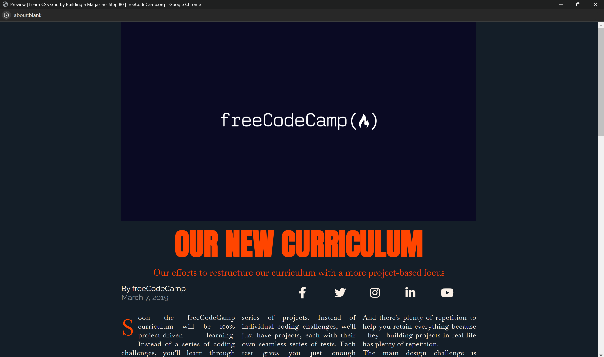

# Magazine Project

## Overview

The Magazine project is a small web application aimed at showcasing articles and content in a visually appealing and structured manner. It utilizes HTML and CSS to create a responsive layout that adapts to different screen sizes, ensuring a seamless viewing experience across devices.

## Features

### Responsive Design

The project employs responsive design techniques using CSS media queries to ensure that content is displayed optimally on various devices, including desktops, tablets, and mobile phones.

### Typography

Careful attention has been paid to typography to enhance readability and aesthetics. Different fonts from the Google Fonts library have been utilized, including Baskervville, Anton, and Raleway, to create a visually appealing text hierarchy.

### Grid Layout

The layout of the magazine is based on CSS Grid, allowing for flexible and dynamic positioning of content elements. This provides a structured and organized presentation of articles and accompanying media.

### Hero Section

The hero section features a prominent image with a captivating title and subtitle, grabbing the viewer's attention and setting the tone for the rest of the content.

### Author and Publication Details

Each article includes details about the author and the publication date, providing credibility and context to the content.

### Social Media Integration

Social media icons are provided, allowing users to easily share the articles on various platforms and engage with the magazine's content.

### Project-Based Learning Focus

The content of the magazine emphasizes project-based learning, with articles discussing the benefits and implementation of this approach in education. The use of quotes and visual aids helps reinforce key concepts and engage the audience.

## Preview

## Installation

To install the Magazine project locally, follow these steps:

Clone the repository to your local machine using Git:

git clone https://github.com/Yashi-Singh-1/Magazine

Alternatively, you can download the project files as a zip archive and extract them to your desired location.

Open the index.html file in a web browser to view the magazine.

## Usage

To use the Magazine project:

1. Clone the repository or download the project files.
2. Open the index.html file in a web browser to view the magazine.
3. Explore the different sections and articles to get a sense of the project-based learning focus.
4. Experiment with the responsive design by resizing the browser window or viewing the magazine on different devices.

## Contributing

Contributions to the Magazine project are welcome! If you have ideas for new features, improvements, or bug fixes, please feel free to open an issue or submit a pull request on the project's GitHub repository.

## Credits

- **freeCodeCamp**: The content and images used in the Magazine project are sourced from freeCodeCamp, a non-profit organization that provides free coding education to millions of learners worldwide.

- **Google Fonts**: The fonts used in the project are from the Google Fonts library, which offers a wide selection of open-source fonts for web design.

- **Font Awesome**: The social media icons used in the project are from Font Awesome, a popular icon set and toolkit.